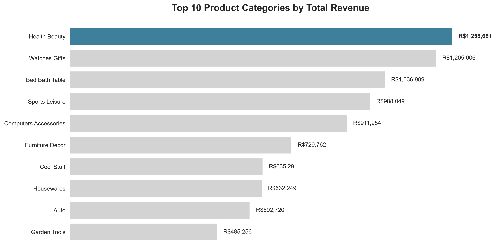
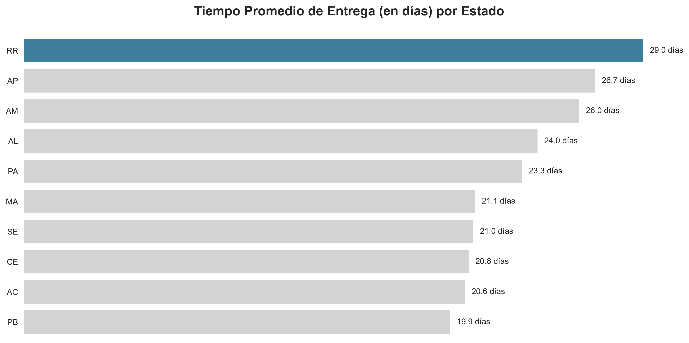
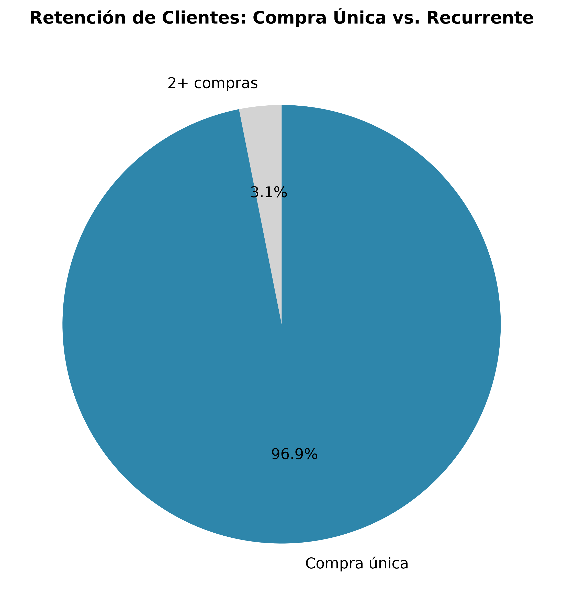
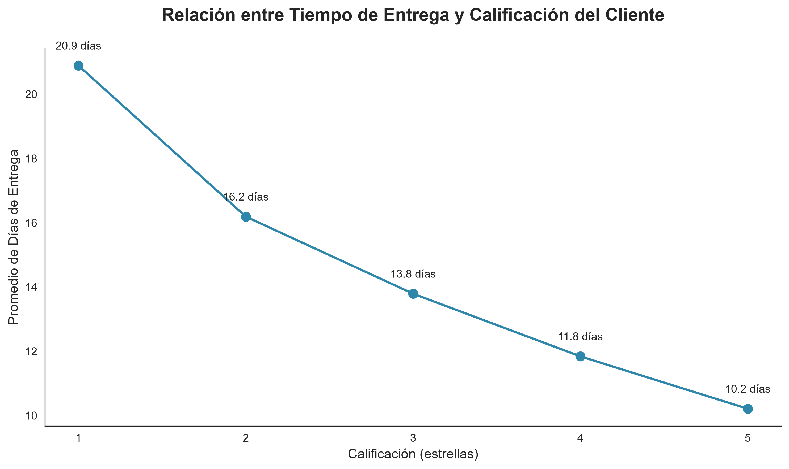
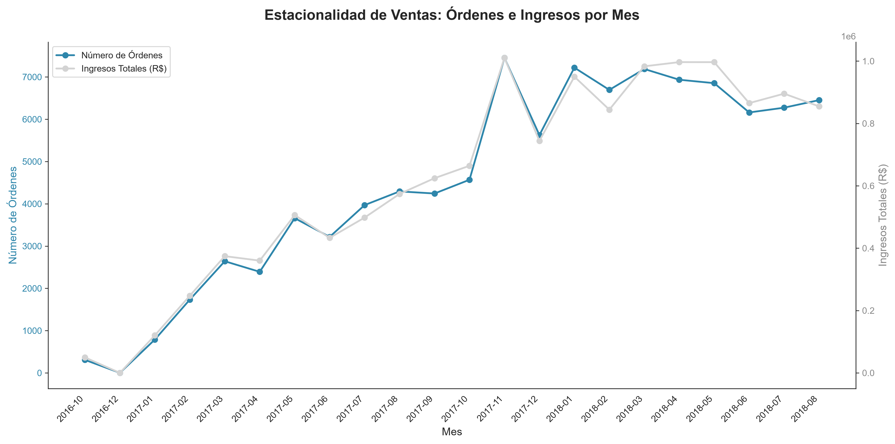

# 📊 Análisis de E-commerce Olist

**Análisis completo de más de 100,000 órdenes de un marketplace brasileño**

Proyecto de Data Analysis que identifica patrones clave en logística, categorías de productos y satisfacción del cliente usando SQL, Python y visualizaciones.

---

## 🎯 Resumen Ejecutivo

Este proyecto analiza el dataset público de **Olist** (marketplace brasileño) con:
- **1.5M+ registros** en 9 tablas relacionales
- **5 preguntas de negocio** respondidas con SQL
- **Insights accionables** para decisiones estratégicas
- **Correlaciones descubiertas** entre logística y satisfacción

**Stack:** PostgreSQL + Python (Pandas, Matplotlib, Seaborn)
**Objetivo:** Demostrar capacidades como Data Analyst Junior

---

## 🔍 Preguntas Respondidas & Insights

### 1️⃣ ¿Cuáles son las categorías con más ingresos?

```sql
SELECT product_category_name, SUM(price) AS ingresos_totales
FROM products JOIN order_items USING(product_id)
GROUP BY product_category_name
ORDER BY ingresos_totales DESC
```



**Insight:**
- 🏆 **Belleza lidera con 1.2M en ingresos** (9.6K ventas, precio promedio: R$130)
- Top 5 categorías representan ~40% del total
- Productos de belleza tienen alto ticket promedio y demanda consistente

**Recomendación:** Enfocar marketing y promociones en belleza; investigar por qué otras categorías no escalan.

---

### 2️⃣ ¿Cuál es el tiempo de entrega por estado?

```sql
SELECT customer_state, 
       ROUND(AVG(EXTRACT(DAY FROM (delivered_date - purchase_date))), 2) 
       AS promedio_dias_entrega
FROM orders JOIN customers USING(customer_id)
GROUP BY customer_state
ORDER BY promedio_dias_entrega ASC
```



**Insight:**
- 📍 **São Paulo: 8.30 días** (hub logístico principal, eficiente)
- 📍 **Estados del norte (AC, PB, PI): 18-20 días** (lejanos, problema logístico)
- Correlación clara: mientras más al norte, más días de espera

**Recomendación:** Abrir centros de distribución en el norte/nordeste; ajustar promesas de entrega por región.

---

### 3️⃣ ¿Qué tan bien retiene clientes el negocio?

```sql
WITH compras_por_cliente AS (
    SELECT customer_unique_id, COUNT(order_id) AS num_compras
    FROM customers JOIN orders USING(customer_id)
    GROUP BY customer_unique_id
)
SELECT 
    CASE WHEN num_compras = 1 THEN 'Compra única' ELSE '2+ compras' END AS tipo_cliente,
    COUNT(*) AS num_clientes,
    ROUND(100.0 * COUNT(*) / SUM(COUNT(*)) OVER (), 2) AS porcentaje
FROM compras_por_cliente
GROUP BY tipo_cliente
```



**Nota metodológica:** El análisis inicial (clientes/órdenes por estado) mostró un ratio de 1:1 en TODOS los estados, sin variación geográfica. Se replanteó el análisis a nivel de cliente individual para medir retención real.

**Insight - HALLAZGO CRÍTICO:**
- 😟 **96.88% de los clientes (93,099) compró UNA SOLA VEZ**
- Solo **3.12% (2,997)** volvió a comprar
- No es un problema regional, es estructural a nivel nacional

**Recomendación:** La adquisición de clientes funciona, pero la retención es prácticamente inexistente. Priorizar estrategias de recompra sobre adquisición de nuevos clientes.

---

### 4️⃣ ¿Hay correlación entre entrega y calificación?

```sql
SELECT review_score,
       ROUND(AVG(EXTRACT(DAY FROM (delivered_date - purchase_date))), 2) 
       AS promedio_dias_entrega
FROM orders JOIN order_reviews USING(order_id)
GROUP BY review_score
ORDER BY review_score ASC
```



**Insight - CORRELACIÓN CASI PERFECTA:**
| Rating | Días Promedio |
|--------|---------------|
| ⭐ (1) | 20.9 días |
| ⭐⭐ (2) | 16.2 días |
| ⭐⭐⭐ (3) | 13.8 días |
| ⭐⭐⭐⭐ (4) | 11.8 días |
| ⭐⭐⭐⭐⭐ (5) | 10.2 días |

**Recomendación:** 🚨 **La velocidad de entrega es el principal factor de satisfacción.** ROI prioritario: invertir en logística, no publicidad.

---

### 5️⃣ ¿Hay estacionalidad en las ventas?

```sql
SELECT DATE_TRUNC('month', order_purchase_timestamp) AS mes,
       COUNT(DISTINCT order_id) AS ordenes,
       SUM(price) AS ingresos_totales
FROM orders JOIN order_items USING(order_id)
WHERE order_purchase_timestamp >= '2016-10-01'
  AND order_purchase_timestamp < '2018-09-01'
GROUP BY mes
ORDER BY mes ASC
```



**Insight:**
- 📈 Tendencia de **crecimiento sostenido** de octubre 2016 a agosto 2018
- 📈 **Pico:** noviembre 2017 (~7,400 órdenes)
- Nota: se excluyeron los meses de los extremos (sep 2016, sep 2018) por estar incompletos en el dataset, evitando así una caída falsa en la gráfica

**Recomendación:** Preparar inventario y logística para sostener la curva de crecimiento; investigar los factores detrás del pico de noviembre 2017 para replicarlos.

---

## 📁 Estructura del Proyecto

```
olist-ecommerce-analysis/
│
├── README.md
├── requirements.txt
├── .gitignore
│
├── sql/                               # 📊 Consultas SQL documentadas
│   ├── 01_schema.sql
│   ├── 02_q1_categorias_ingresos.sql
│   ├── 03_q2_entrega_por_estado.sql
│   ├── 04_q3_clientes_ordenes.sql
│   ├── 05_q4_entrega_vs_rating.sql
│   └── 06_q5_estacionalidad_ventas.sql
│
├── notebooks/                         # 📓 Análisis en Python
│   └── analisis_completo.ipynb
│
├── data/
│   ├── raw/                          # CSVs originales (no versionados)
│   └── processed/
│
├── visualizations/                   # 📈 Gráficas generadas
│   ├── 01_categorias_ingresos.png
│   ├── 02_entrega_por_estado.png
│   ├── 03_retencion_clientes.png
│   ├── 04_entrega_vs_rating.png
│   └── 05_estacionalidad_ventas.png
│
└── reports/
    └── ANALISIS_COMPLETO.md
```

---

## 🛠️ Stack Técnico

| Tecnología | Uso |
|-----------|-----|
| **PostgreSQL** | Base de datos relacional, almacenamiento y consultas SQL |
| **pgAdmin** | Interfaz gráfica para PostgreSQL |
| **Python 3.9+** | Procesamiento y visualización de datos |
| **Pandas** | Manipulación y limpieza de datos |
| **Matplotlib & Seaborn** | Visualizaciones profesionales |
| **Jupyter (Anaconda)** | Ambiente de análisis interactivo |
| **Git & GitHub** | Control de versiones y portafolio |

---

## 🚀 Cómo Reproducir el Análisis

### Requisitos previos
- PostgreSQL instalado
- Python 3.9+ (recomendado vía Anaconda)
- Git

### Paso 1: Clonar el repositorio
```bash
git clone https://github.com/tu_usuario/olist-ecommerce-analysis.git
cd olist-ecommerce-analysis
```

### Paso 2: Instalar dependencias Python
```bash
pip install -r requirements.txt
```

### Paso 3: Descargar el dataset
1. Ve a Kaggle: [Olist E-Commerce Dataset](https://www.kaggle.com/datasets/olistbr/brazilian-ecommerce)
2. Descarga todos los CSVs
3. Colócalos en `data/raw/`

### Paso 4: Crear la base de datos
```bash
psql -U tu_usuario -d tu_base_datos -f sql/01_schema.sql
```

### Paso 5: Importar los datos
Usa pgAdmin (clic derecho en cada tabla → Import/Export Data) o `\COPY` desde `psql`.

### Paso 6: Ejecutar el notebook
```bash
jupyter notebook notebooks/analisis_completo.ipynb
```

---

## 💡 Key Insights (Resumen)

### ✅ Lo que funciona bien
- **Categoría Belleza:** revenue engine consistente, alto ticket promedio
- **Logística en São Paulo:** eficiente (8.3 días), hub principal bien gestionado
- **Crecimiento:** tendencia ascendente sostenida en el periodo analizado

### ⚠️ Oportunidades críticas
- **Retención de clientes:** solo 3.12% de los clientes vuelve a comprar
- **Velocidad de entrega en norte/nordeste:** hasta 2.5x más lento que São Paulo
- **Satisfacción del cliente:** directamente correlacionada con velocidad de entrega

### 🎯 Recomendaciones prioritarias
1. **URGENTE:** Implementar estrategias de retención/loyalty (96.88% de clientes solo compra una vez)
2. **Logística:** invertir en centros de distribución regional para el norte/nordeste
3. **Marketing:** enfocar en belleza; investigar por qué otras categorías no escalan igual

---

## 📊 Metodología

### Proceso de análisis (4 pasos)
1. **Entender la pregunta:** ¿qué quiero saber?
2. **Identificar datos:** ¿de dónde vienen? ¿qué tablas?
3. **Construir consulta:** JOINs, agregaciones, filtros
4. **Interpretar resultados:** ¿qué significa? ¿qué acción recomienda?

### Limpieza y validación de datos
- Eliminación de duplicados en reseñas (`order_reviews`)
- Manejo de caracteres especiales y saltos de línea en comentarios
- Exclusión de órdenes sin entregar para cálculos de logística
- Exclusión de meses incompletos en el análisis de estacionalidad, tras validar las fechas mínima/máxima del dataset

---

## 📈 Habilidades Demostrables

Este proyecto demuestra:
- ✅ **SQL avanzado:** JOINs complejos, CTEs, CASE WHEN, funciones de fecha, agregaciones
- ✅ **Pensamiento analítico:** de pregunta → insight → acción, incluyendo pivotar el enfoque cuando el análisis inicial no revela nada útil
- ✅ **Storytelling con datos:** comunicar resultados en contexto de negocio
- ✅ **Limpieza y validación:** detectar y corregir datos incompletos o erróneos
- ✅ **Versionamiento:** Git, GitHub, buenas prácticas de código
- ✅ **Visualización:** gráficas con estilo consistente y enfocadas en el insight

---

## 📞 Contacto

**LinkedIn:** [Tu perfil]
**GitHub:** [Tu usuario]
**Email:** [Tu email]

---

## 📝 Licencia

Este proyecto usa el dataset público de Olist disponible en Kaggle bajo [CC0 1.0 Universal](https://creativecommons.org/publicdomain/zero/1.0/).

---

## 🙏 Agradecimientos

- Dataset: [Olist](https://www.kaggle.com/datasets/olistbr/brazilian-ecommerce)
- Mentoría en SQL: curso de José Portilla (Udemy)
- Formación Data Science: Programa ONE (Oracle + Alura)

- Formación Data Science: Programa ONE (Oracle + Alura)

---

**Última actualización:** Agosto 2026  
**Estado:** En desarrollo (visualizaciones pendientes)
